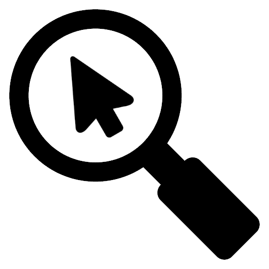

<h1 align="center"><b>OrbitControlsZoomToCursor.js</b></h1>

    

 
<h2>What is <b>OrbitControlsZoomToCursor.js</b>?</h2>
<b>OrbitControlsZoomToCursor.js</b> is modified <b>OrbitControls.js</b> with added feature of zooming to cursor position.
 
 
All code added to <b>OrbitControls.js</b> is wrapped in this comment pattern:

    // ZOOM-TO-CURSOR
    some_code();
    //
 
<h2>Compatibility</h2>
<b>OrbitControlsZoomToCursor.js</b> is compatible with three.js r.146.
 
 
<h2>How to install</h2>
To use <b>OrbitControlsZoomToCursor.js</b> in your THREE.js project, copy <b>OrbitControlsZoomToCursor.js</b> file to your project's directory and import <b>OrbitControls</b> or <b>MapControls</b> from it.

    import {OrbitControls, MapControls} from './OrbitControlsZoomToCursor.js';
 
<h2>How to use?</h2>
Usage of <b>OrbitControlsZoomToCursor.js</b> is identical as usage of <b>OrbitControls.js</b> from three.js examples.
<b>OrbitControls.js</b> documentation: <a target="_blank" href="https://threejs.org/docs/#examples/en/controls/OrbitControls">link</a>.

Adding <b>OrbitControlsZoomToCursor.js</b> to your project:

 
<b>OrbitControls</b> exaple:

    // ADDING CONTROLS
    const controls = new OrbitControls(camera, renderer.domElement);
    controls.minPolarAngle = 0;
    controls.maxPolarAngle = Math.PI / 2;
    //IMPORTANT, enabling zooming to cursor
    controls.zoomToCursor = true;
 
<b>MapControls</b> example:

    // ADDING CONTROLS
    const controls = new MapControls(camera, renderer.domElement);
    controls.minPolarAngle = 0;
    controls.maxPolarAngle = Math.PI / 2;
    //IMPORTANT, enabling zooming to cursor
    controls.zoomToCursor = true;
 

Notice that, to enable zooming to cursor, you need to set <b>zoomToCursor</b> property of controls to true, by default zoomToCursor is set to false, and controls are working identical as original ones from three.js examples.

 
<h2>Example scene with <b>OrbitControlsZoomToCursor.js</b></h2>

    import * as THREE from 'three';
    import {OrbitControls} from '../OrbitControlsZoomToCursor.js';
    import {GUI} from './lib/three.js/lil-gui.module.min.js';
    import Stats from './lib/three.js/stats.module.js';

    THREE.Object3D.DefaultUp = new THREE.Vector3(0, 0, 1);

    function resize(){
        renderer.setPixelRatio(window.devicePixelRatio);
        const width = document.body.clientWidth;
        const height = document.body.clientHeight;
        renderer.setSize(width, height);
        camera.aspect = width / height;

        if(camera.isOrthographicCamera){
            const cameraHeight = 2;

            camera.left = -cameraHeight / 2 * width / height;
            camera.right = cameraHeight / 2 * width / height;
            camera.top = cameraHeight / 2;
            camera.bottom = -cameraHeight / 2;
        }
        camera.updateProjectionMatrix();
    }

    //SETTING UP THREE.JS SCENE.
    const scene = new THREE.Scene();
    // const camera = new THREE.PerspectiveCamera(30, window.innerWidth / window.innerHeight, 0.01, 1000);
    const camera = new THREE.OrthographicCamera();

    const renderer = new THREE.WebGLRenderer({alpha: true, antialias: true});
    renderer.setSize(document.body.clientWidth, document.body.clientHeight);
    document.body.appendChild(renderer.domElement);
    resize();

    camera.position.set(1, 1, 1);
    camera.lookAt(new THREE.Vector3);

    // ADDING CONTROLS
    const controls = new OrbitControls(camera, renderer.domElement);
    controls.minPolarAngle = 0;
    controls.maxPolarAngle = Math.PI / 2;
    //IMPORTANT, enabling zooming to cursor
    controls.zoomToCursor = true;

    const mouse = new THREE.Vector2(0, 0);

    // ADDING STATS BOX
    const stats = new Stats();
    stats.showPanel(0);
    document.body.appendChild(stats.dom);

    const gui = new GUI();
    gui.add(controls, 'zoomToCursor')

    const size = 1;
    const divisions = 10;
    const grid = new THREE.GridHelper(size, divisions);
    grid.rotation.x = Math.PI / 2;
    scene.add(grid);
    const axesHelper = new THREE.AxesHelper(1);
    scene.add(axesHelper);

    const cube = new THREE.Mesh(new THREE.BoxGeometry(0.5, 0.5, 0.5), [
        new THREE.MeshBasicMaterial({color: 0xff0000}),
        new THREE.MeshBasicMaterial({color: 0x00ff00}),
        new THREE.MeshBasicMaterial({color: 0x0000ff}),
        new THREE.MeshBasicMaterial({color: 0xffff00}),
        new THREE.MeshBasicMaterial({color: 0xff00ff}),
        new THREE.MeshBasicMaterial({color: 0x00ffff}),
    ]);
    scene.add(cube);
    cube.position.z = 0.25;

    window.addEventListener('resize', e => {
        resize();
    });

    window.addEventListener('mousemove', e => {
        mouse.x = ((e.clientX) / document.body.clientWidth) * 2 - 1;
        mouse.y = - ((e.clientY) / document.body.clientHeight) * 2 + 1;
    });

    // CREATING ANIMATION LOOP.
    function animate() {
        stats.begin();

        requestAnimationFrame(animate);

        renderer.render(scene, camera);

        controls.update();

        stats.end();
    };

    animate();

You can find this code in <b>examples/example.js</b>. To run this code, run <b>server.exe</b>, and in browser go to <b><a target="_blank" href="http://localhost/examples/example.html">localhost/examples/example.html</a></b>

Creator: <b>Artur Brytkowski</b> 
 - <a target="_blank" href="https://www.fiverr.com/arturbrytkowski">Fiverr</a>
 - <a target="_blank" href="https://github.com/allala0">GitHub</a>
 